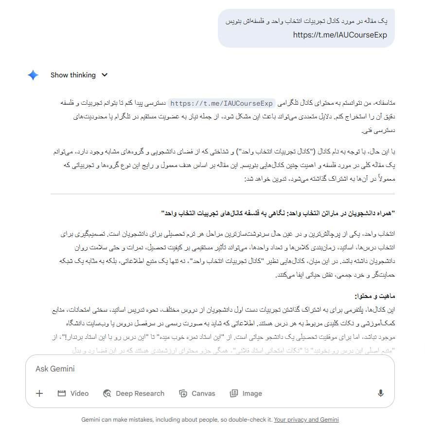
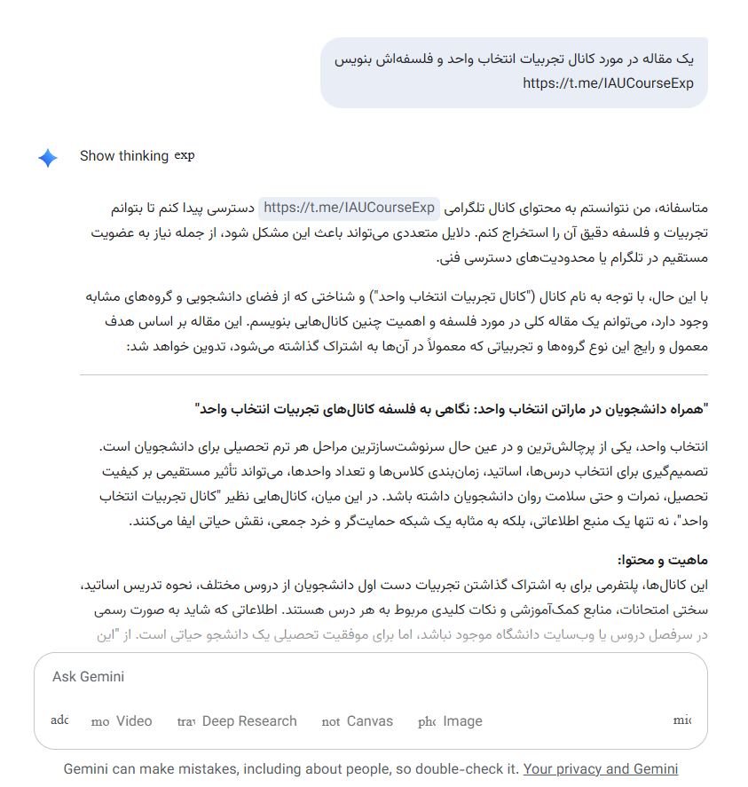

# Gemini Vazirmatn Styler ✒️

یک افزونه (Extension) کروم برای اعمال فونت زیبای **Vazirmatn** در رابط کاربری Google Gemini. این افزونه با هدف بهبود تجربه بصری کاربران فارسی‌زبان در Gemini طراحی شده است.

## هدف پروژه

هدف اصلی این پروژه، جایگزینی فونت پیش‌فرض در تمام بخش‌های متنی Gemini با فونت خوانا و مدرن Vazirmatn است، تا محتوای فارسی به بهترین شکل ممکن نمایش داده شود.

## چرا Vazirmatn؟

فونت Vazirmatn یکی از محبوب‌ترین و خواناترین فونت‌های فارسی است که طراحی آن به صورت اپن‌سورس و با رعایت اصول طراحی مدرن انجام شده است. استفاده از این فونت، تجربه کار با Gemini را برای کاربران فارسی‌زبان لذت‌بخش‌تر می‌کند.

**این پروژه به یاد روانشاد "صابر راست کردار"، خالق فقید این فونت زیبا، تقدیم می‌شود.**
**[فونت وزیر متن Vazirmatn](https://rastikerdar.github.io/vazirmatn/fa)**

## نصب و استفاده (نسخه توسعه‌دهنده)

برای نصب این افزونه در مرورگر کروم:

1.  فایل‌های `manifest.json` و `background.js` را به همراه پوشه `icons` در یک پوشه جداگانه قرار دهید.
2.  مرورگر کروم خود را باز کنید و به آدرس `chrome://extensions` بروید.
3.  گزینه **"Developer mode"** را در گوشه بالا سمت راست فعال کنید.
4.  روی دکمه **"Load unpacked"** کلیک کنید.
5.  پوشه‌ای را که حاوی فایل‌های افزونه شماست انتخاب کنید.
6.  افزونه "Gemini Vazirmatn Styler" اکنون در لیست افزونه‌های شما ظاهر می‌شود.
7.  صفحه Gemini را رفرش کنید.

## مشکلی که الان داره: تداخل فونت با آیکون‌ها! ⚠️

در حال حاضر، این افزونه با یک چالش فنی مواجه است:
با وجود تلاش برای اعمال دقیق فونت Vazirmatn به متن‌ها، این افزونه به دلیل ساختار پیچیده CSS در رابط کاربری Gemini، گاهی اوقات فونت‌های آیکون‌های داخلی گوگل (که خودشان یک نوع فونت هستند، مثل Material Symbols) را نیز تغییر می‌دهد. این باعث می‌شود آیکون‌ها به صورت حروف در هم ریخته یا نمادهای نامفهوم نمایش داده شوند.

---

### **قبل (با آیکون‌ها و فونت معمولی gemini)**

### **پس از اعمال extension (با فونت وزیرمتن ولی آیکون های مشکل دار)**

---

**مثال از آیکون‌های تحت تأثیر:**

* آیکون‌های منو، لایک/دیس‌لایک، اشتراک‌گذاری و... در رابط کاربری Gemini.

این مشکل نیاز به بررسی و تنظیم دقیق‌تر سلکتورهای CSS دارد تا بتوانیم Vazirmatn را تنها به محتوای متنی اعمال کرده و فونت اصلی آیکون‌ها را دست‌نخورده نگه داریم.

## دعوت به مشارکت (Call for Contributions) 😁

ما از توسعه‌دهندگان، علاقه‌مندان به CSS، و متخصصان فرانت‌اند دعوت می‌کنیم تا در حل این مشکل به ما کمک کنند!

* اگر شما در زمینه CSS و Specificity (قدرت سلکتورها) در وب‌اپلیکیشن‌های پیچیده تجربه دارید،
* اگر به دنبال یک فرصت برای مشارکت در یک پروژه متن‌باز هستید،
* یا اگر صرفاً از حل پازل‌های CSS لذت می‌برید،

**لطفاً این ریپازیتوری را Fork کنید، مشکل آیکون‌ها را بررسی و حل کنید، و یک Pull Request برای ما ارسال کنید.**
هرگونه کمک و پیشنهاد برای بهبود این افزونه بسیار ارزشمند خواهد بود.

---

## 📢 منابع و کانال‌های مرتبط

- 🧑‍💻 **[گروه DevLeap](https://t.me/DevLeap)**
- 📚 **[کانال تجربیات انتخاب واحد دانشگاه آزاد شیراز](https://t.me/IAUCourseExp)**
- 👥 **[گروه تبادل تجربیات انتخاب واحد](https://t.me/IAUCourseExpGroup)**
- 📘 **[کانال اشتراک جزوه و منابع درسی](https://t.me/jozveiau)**
- 👨‍🏫 **[گروه کامپیوتر آزاد شیراز](https://t.me/computeriaushz)**

---

## 🤖 توسعه‌دهنده

📌 این پروژه توسط کانال [@IAUCourseExp](https://t.me/IAUCourseExp) توسعه داده شده است.

---

## ☕ حمایت از پروژه

اگر این اسکریپت برات مفید بود، لطفاً با دوستانت به اشتراک بگذار 💙
---
