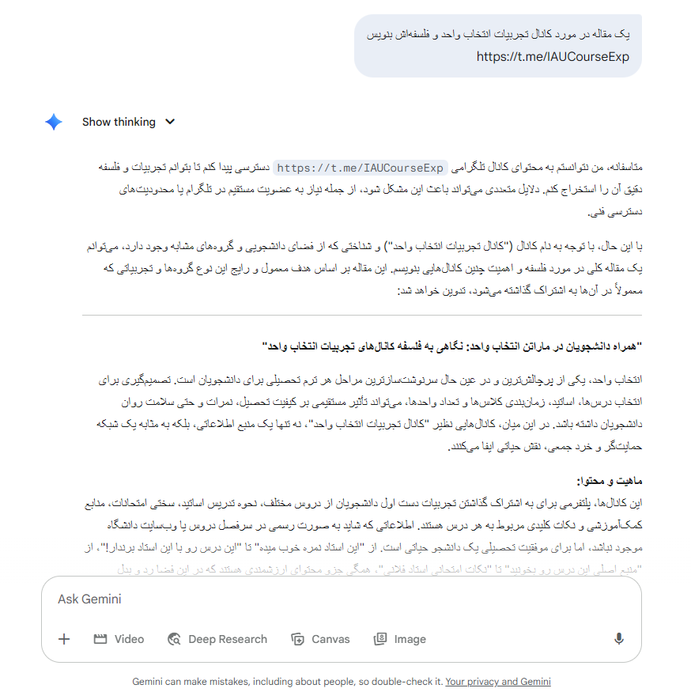

**[Farsi Readme](README.md)**

# Gemini Vazirmatn Styler ✒️

A Chrome Extension designed to apply the beautiful **Vazirmatn** font to the Google Gemini user interface. This extension aims to enhance the visual experience for Persian-speaking users in Gemini.

## Project Goal

The main goal of this project is to replace Gemini's default font across all text sections with the readable and modern Vazirmatn font, ensuring that Persian content is displayed in the best possible way.

## Why Vazirmatn?

Vazirmatn is one of the most popular and legible Persian fonts, designed as an open-source project adhering to modern design principles. Using this font significantly improves the experience of working with Gemini for Persian-speaking users.

**This project is dedicated to the memory of the late "Saber Raastkerdar", the esteemed creator of this beautiful font.**
**[Vazirmatn Font (Official Website)](https://rastikerdar.github.io/vazirmatn/fa)**

## Installation and Usage (Developer Version)

To install this extension in your Chrome browser:

1.  Place the `manifest.json` and `background.js` files, along with the `icons` folder, in a separate directory.
2.  Open your Chrome browser and navigate to `chrome://extensions`.
3.  Enable **"Developer mode"** in the top-right corner.
4.  Click on the **"Load unpacked"** button.
5.  Select the folder containing your extension files.
6.  The "Gemini Vazirmatn Styler" extension will now appear in your extensions list.
7.  Refresh your Gemini page (`gemini.google.com`).

## Known Issue: Font Conflict with Icons! ⚠️

Currently, this extension faces a technical challenge:
Despite efforts to accurately apply the Vazirmatn font to text, due to the complex CSS structure within Gemini's user interface, the extension sometimes inadvertently changes Google's internal icon fonts (which are themselves a type of font, like Material Symbols). This results in icons appearing as scrambled characters or unintelligible symbols.

---

### **Before (with regular Gemini icons and font)**

### **After Extension Applied (with Vazirmatn font but problematic icons)**

---

**Examples of affected icons:**

* Menu icons, Like/Dislike buttons, Share icons, etc., throughout the Gemini UI.

This issue requires further investigation and more precise CSS selector adjustments to ensure Vazirmatn is applied only to textual content, leaving the original icon fonts untouched.

## Call for Contributions! 😁

We invite developers, CSS enthusiasts, and front-end specialists to help us resolve this issue!

* If you have experience with CSS and managing Specificity in complex web applications,
* If you are looking for an opportunity to contribute to an open-source project,
* Or if you simply enjoy solving CSS puzzles,

**Please Fork this repository, investigate and fix the icon issue, and submit a Pull Request.**
Any help and suggestions for improving this extension would be highly valuable.

---

## 📢 Related Resources and Channels

-   🧑‍💻 **[DevLeap Group](https://t.me/DevLeap)**
-   📚 **[IAU Shiraz Course Selection Experiences Channel](https://t.me/IAUCourseExp)**
-   👥 **[Course Selection Experiences Exchange Group](https://t.me/IAUCourseExpGroup)**
-   📘 **[Study Materials and Resources Channel](https://t.me/jozveiau)**
-   👨‍🏫 **[IAU Shiraz Computer Group](https://t.me/computeriaushz)**

---

## 🤖 Developer

📌 This project is developed by [@IAUCourseExp](https://t.me/IAUCourseExp) channel.

---

## ☕ Support the Project

If this script was helpful to you, please share it with your friends 💙

---
